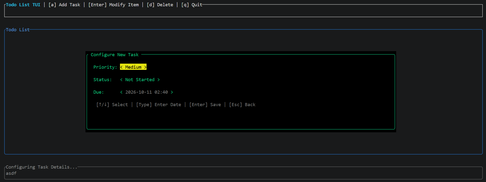

# RustTodoList
Simple todo list created with Rust.
It stores todo list items in json in a file it creates: `TodoList.json`
It features functionality including setting task priority, status (whether it's not started, in progress, or complete), and setting a due date.
